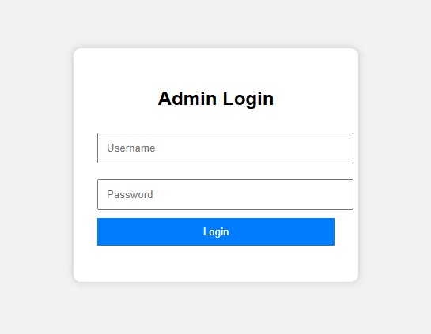
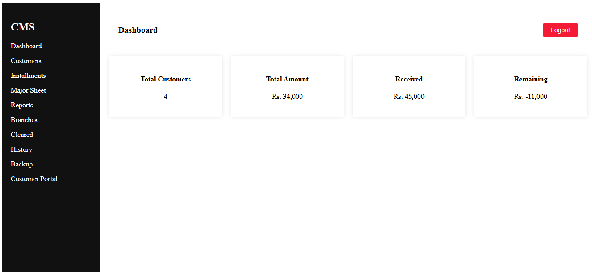
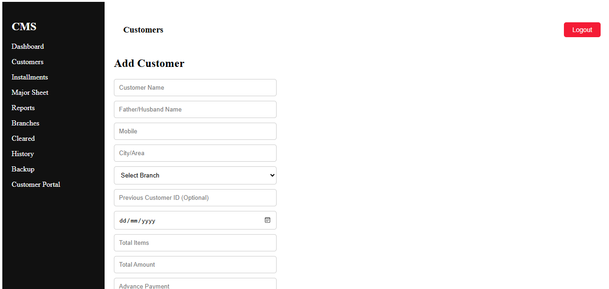
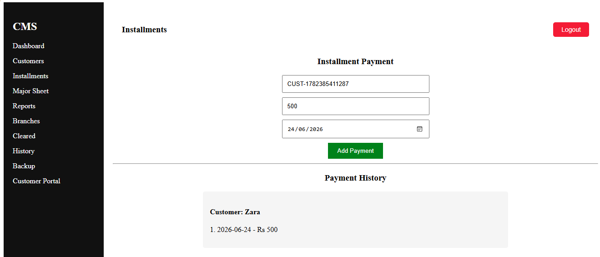
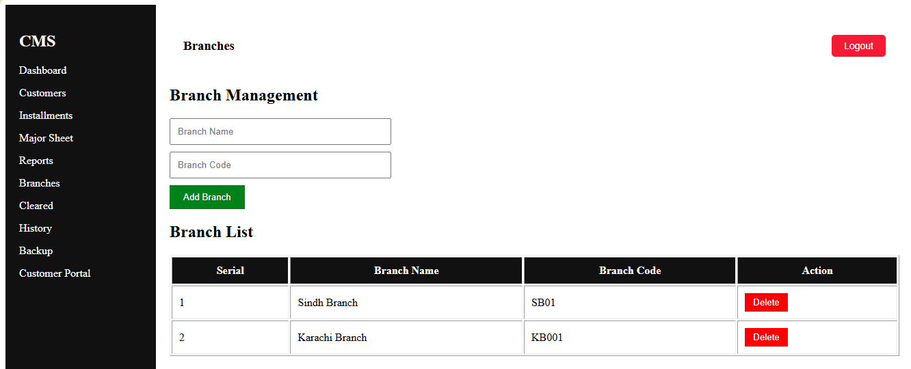
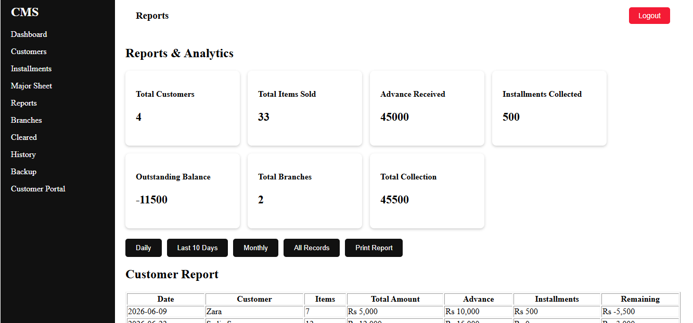
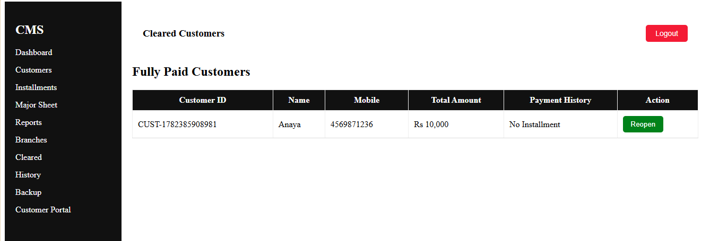
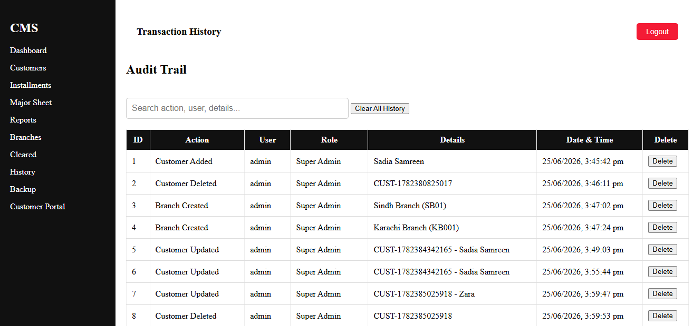
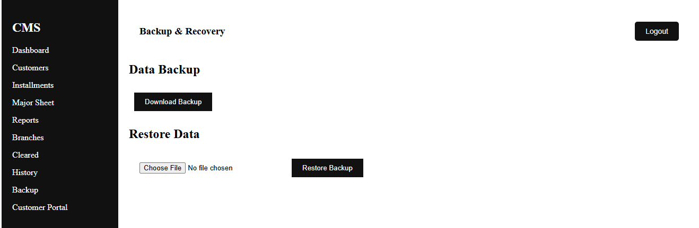
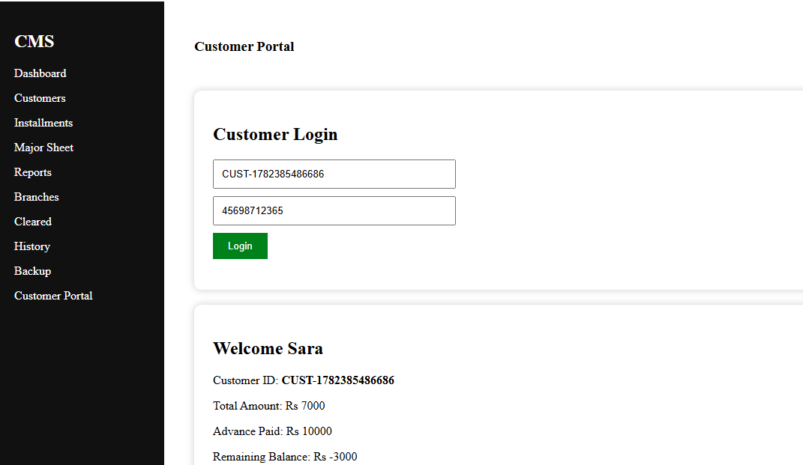

# Customer Management System (CMS)

A complete **Customer Management System** developed using **HTML, CSS, and JavaScript**.  
This project helps businesses manage customers, branches, installments, payments, reports, transaction history, and customer accounts through an interactive web-based dashboard.

The system uses **LocalStorage** for data persistence and provides role-based access control for secure management.

---

# Project Preview

## Login Page

The system starts with a secure login page where users can access the system according to their assigned role.




---

# Features

## 1. Authentication & Security

- User login system
- Password protection
- Login attempt limitation
- Account lock mechanism
- Logout functionality
- Role-based permissions:
  - Super Admin
  - Branch Manager


---

## 2. Dashboard

The dashboard provides a quick overview of the complete system.

Features:

- Total customers
- Total collection
- Pending balances
- Quick navigation
- System overview





---

# Customer Management

The customer module allows complete customer record management.

Features:

- Add new customers
- Edit customer information
- Delete customers
- Restore deleted customers using Undo feature
- Search customers
- Assign customers to branches
- Generate unique customer IDs
- Maintain purchase records





---

# Installment Management

The installment section manages customer payments and balances.

Features:

- Add installment payments
- Automatic remaining balance calculation
- Payment history tracking
- Generate payment receipt
- Print receipt / Save as PDF
- WhatsApp receipt sharing option





---

# Branch Management

The branch module manages multiple business branches.

Features:

- Add branches
- Generate branch codes
- View branch list
- Delete branches (Super Admin only)
- Assign customers to branches





---

# Reports & Analytics

The reporting system provides business insights.

Features:

- Total customers report
- Total items sold
- Advance payment summary
- Installment collection report
- Outstanding balance calculation
- Total collection calculation

Filter options:

- Daily report
- Last 10 days report
- Monthly report
- Complete records





---

# Cleared Customers

This section displays customers whose payments are fully completed.

Features:

- View cleared customers
- Payment history
- Reopen customer account





---

# Transaction History / Audit Trail

The history module records important system activities.

Tracks:

- Customer creation
- Customer updates
- Customer deletion
- Payment activities
- Branch activities

Features:

- Search history
- Delete individual history records
- Clear complete history
- Super Admin control





---

# Backup & Restore

The backup system protects important application data.

Features:

- Export system data
- Restore saved data
- Data safety management





---

# Customer Portal

A separate customer view section where customers can check their account information.

Features:

- Customer details
- Payment information
- Remaining balance
- Installment records





---

# Technologies Used

## Frontend

- HTML5
- CSS3
- JavaScript


## Storage

- Browser LocalStorage


## Tools

- Visual Studio Code
- Git & GitHub
- Browser Developer Tools


---

# Project Structure

```
Customer-Management-System

│
├── css
│   ├── style.css
│   ├── customers.css
│   ├── reports.css
│   └── other page styles
│
├── js
│   ├── auth.js
│   ├── customers.js
│   ├── installments.js
│   ├── branches.js
│   ├── reports.js
│   ├── history.js
│   └── backup.js
│
├── images
│   └── Project screenshots
│
├── dashboard.html
├── customers.html
├── installments.html
├── reports.html
├── branches.html
├── history.html
├── backup.html
└── customer-portal.html

```

---

# User Roles

## Super Admin

Permissions:

- Add customers
- Edit customers
- Delete customers
- Manage branches
- Delete history
- Access complete system


## Branch Manager

Permissions:

- View records
- Manage allowed operations
- Limited access according to role


---

# Key Functionalities

✔ Customer CRUD Operations  
✔ Installment Tracking  
✔ Receipt Generation  
✔ PDF Printing  
✔ Branch Management  
✔ Reports Generation  
✔ Transaction Audit Trail  
✔ Backup System  
✔ Role-Based Access Control  
✔ Customer Portal  


---

# Future Improvements

Possible future upgrades:

- Backend database integration
- Online authentication
- Cloud backup
- Advanced analytics dashboard
- Mobile application version


---

# Installation & Usage

1. Download or clone the repository.

2. Open the project folder.

3. Open `login.html` in a browser.

4. Login using available credentials.

Example:

```
Username: admin
Password: 12345
```

---

# Developer

**Developed as a Frontend Web Development Project**

Technologies:
HTML | CSS | JavaScript


---

# License

This project is developed for educational and learning purposes.